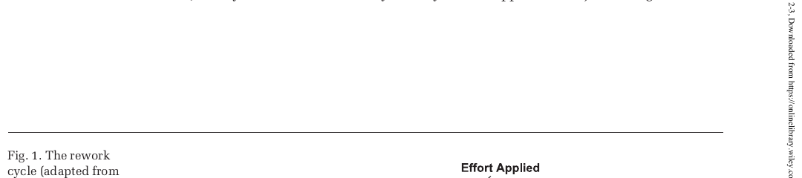
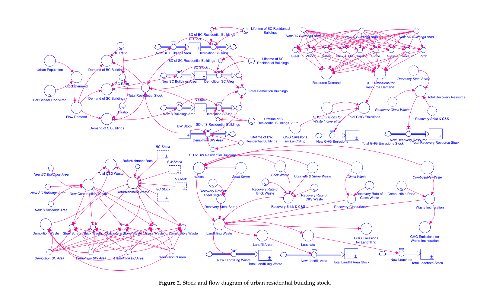
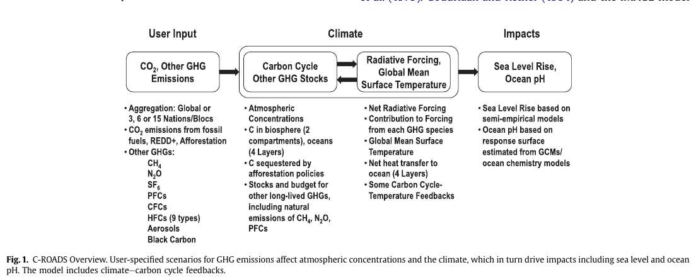
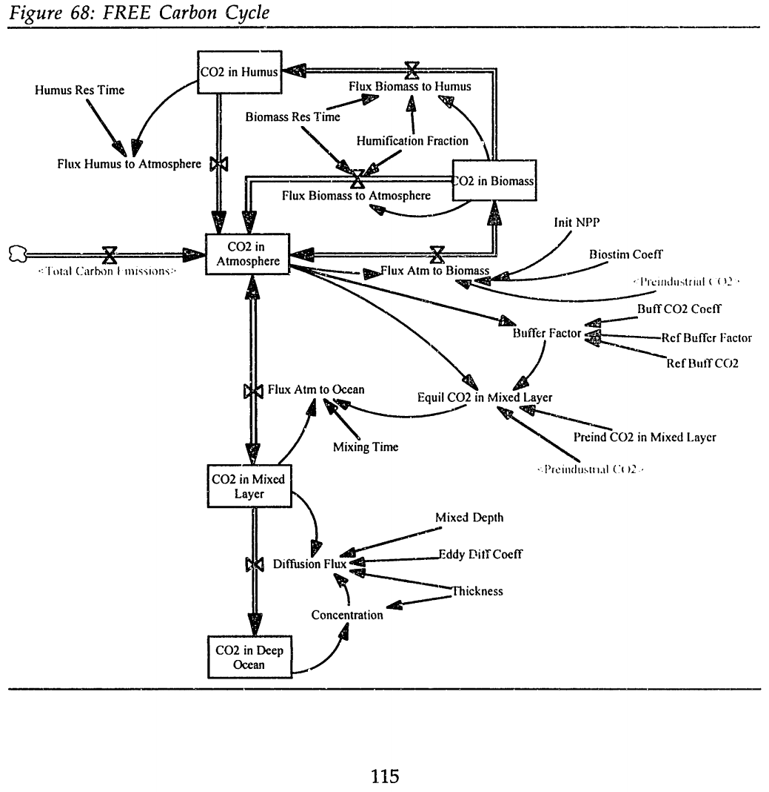

# stock-flow-library

A collection of books and papers containing system dynamics (stock-and-flow) models,
or models directly convertible to stocks and flows, curated as build cases for
[poietic-mcp](https://github.com/soobrosa/poietic-mcp).

- `system-dynamics-stock-flow-sources.md` — the annotated bibliography (books, papers,
  twelve convertible domains, collection status).
- `poietic-mcp-cases.md` — 48 build cases: stocks, flows, and key auxiliaries for each,
  re-specified with full stock/flow/auxiliary detail (fidelity-tagged `[full-text]` / `[canonical]`).
- `figures/` — original figures extracted from the source papers (rasterized at 150 dpi
  by `extract_figures.py`, which locates captions geometrically and crops the figure zone).

| | |
|---|---|
|  |  |
|  |  |

All 12: rework cycle, PM control loops, PM ripple effects (Lyneis-Ford 2007), C-ROADS
overview (Sterman 2013), Zhang SFD (2021), WEEE SFD (Guo et al.), US iron cycle
(Müller 2006), Lotka figs 13-14 (1925), Gordon figs 4 and 6 (1954), FREE carbon cycle
(Fiddaman 1997).

The PDFs themselves are **not committed** (copyright). To fetch the open-access subset:

```bash
./download.sh
```

Paywalled sources (Godley & Lavoie, Sterman 2000, Cooper 1980, etc.) remain to be obtained
via institutional access, library lending, or author request — see the status
section of the sources file for the full missing list and what worked/failed.
